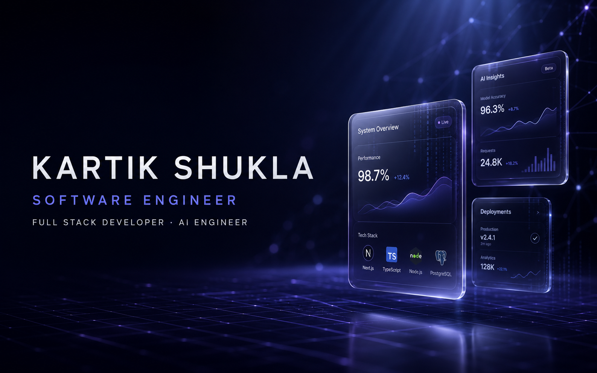
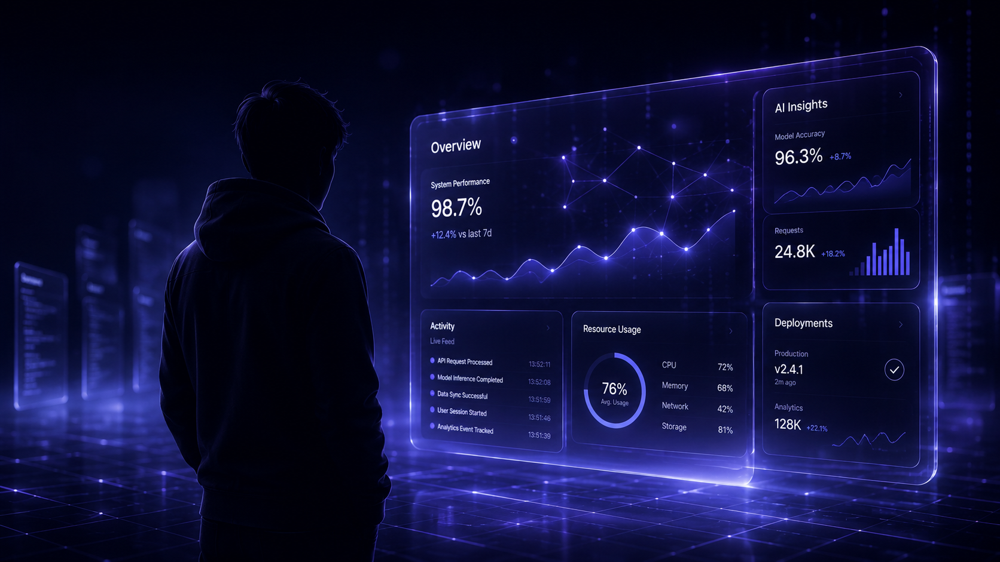
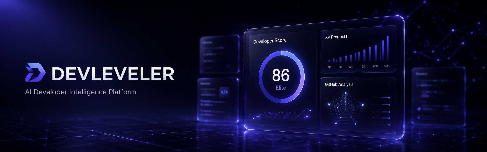
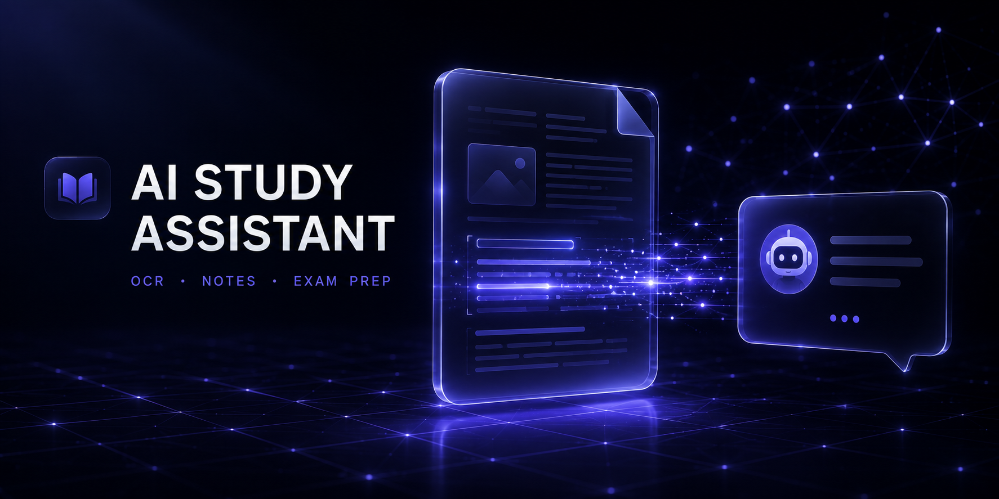
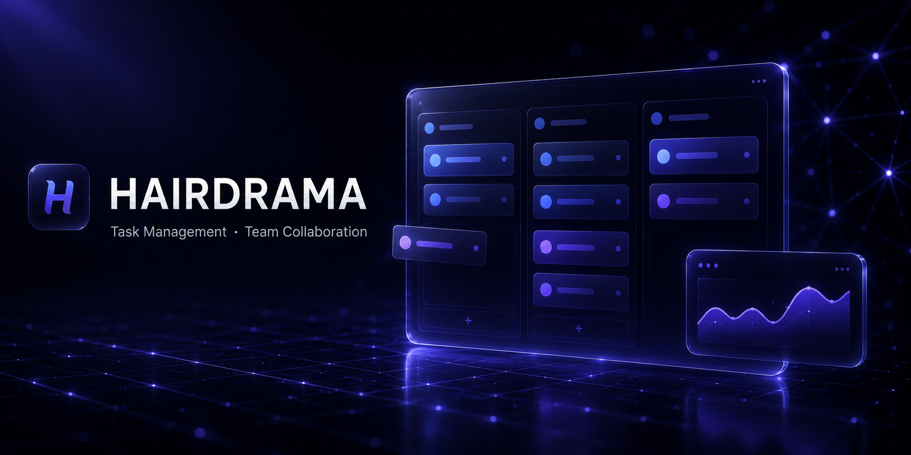
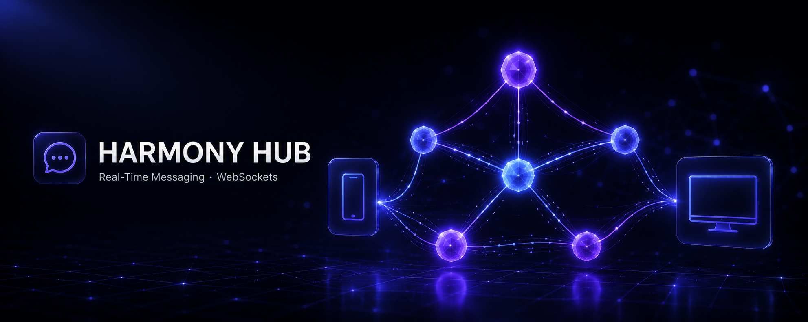
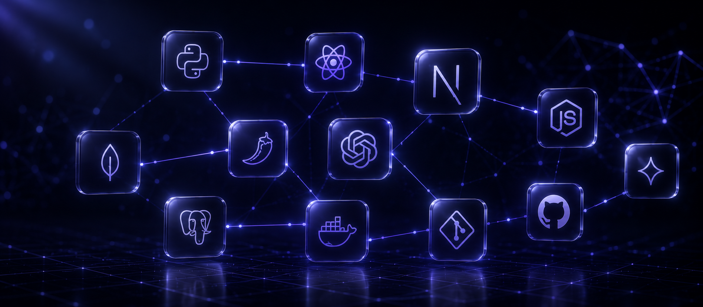

<div align="center">



<a href="https://git.io/typing-svg">
  
</a>

<br/>

[](https://kartik-portfolio-chi-eight.vercel.app)
[](https://www.linkedin.com/in/kartik-shukla-cse)
[](mailto:kartikshukla2301@gmail.com)
[](https://github.com/kartikshukla2301-eng)

<br/>


</div>

<br/>

## Developer Snapshot

```typescript
const kartik: SoftwareEngineer = {
  role        : "Full Stack Developer → AI Engineer",
  location    : "Lucknow, India",
  education   : "B.Tech CSE, AKTU (2023 – 2027) · CGPA 7.68/10",
  building    : "DevLeveler — AI-driven developer scoring & career intelligence platform",
  strengths   : ["Full Stack Engineering", "Backend & API Design", "LLM Integration"],
  status      : "Open to Software Engineering / Full Stack / AI internships — 2026",
};
```

I'm a Computer Science undergraduate who builds **complete, deployed software** — not tutorials. My work spans authenticated full-stack platforms, REST APIs, and LLM-integrated products, with a growing focus on AI agents and Retrieval-Augmented Generation. I care about what ships: authenticated, deployed, and actually used.

<br/>

<div align="center">

</div>

<br/>

## Currently

<table>
<tr>
<td width="25%" align="center"><strong>🔭 Building</strong><br/><sub>DevLeveler — AI developer scoring platform</sub></td>
<td width="25%" align="center"><strong>🌱 Learning</strong><br/><sub>AI Agents · RAG Pipelines · Docker</sub></td>
<td width="25%" align="center"><strong>💼 Open To</strong><br/><sub>SWE / Full Stack / AI internships</sub></td>
<td width="25%" align="center"><strong>💬 Ask Me</strong><br/><sub>React, Node.js, Flask, LLM integration</sub></td>
</tr>
</table>

<br/>

## Featured Projects



### 🧭 DevLeveler <sub>· Flagship · In Development</sub>
**AI-Powered Developer Intelligence Platform** — analyzes GitHub activity, resumes, and project history to generate XP-based developer scores and personalized, AI-driven career roadmaps.

**Key Features:** GitHub activity analysis · XP scoring engine · RAG-based career advisor · ATS resume analysis
**Stack:** `Next.js` `FastAPI` `OpenAI` `RAG` `PostgreSQL` `Docker`
[](https://github.com/kartikshukla2301-eng)

<br/>



### 📚 AI Study Assistant
**OCR + LLM-Powered Learning Platform** — 8,000+ line full-stack PWA that turns scanned or photographed study material into structured, queryable knowledge via OCR and LLMs.

**Key Features:** OCR PDF pipeline · 10+ AI features (chat, notes, exam kit) · JWT + Google OAuth · mobile-first PWA
**Stack:** `React 19` `Vite` `Node.js` `Express.js` `MongoDB Atlas` `OpenAI / Gemini`
[](https://github.com/kartikshukla2301-eng/ai-study-assistant)
[](https://ai-study-assistant-eight-psi.vercel.app)

<br/>



### 📋 Hairdrama — Task Manager
**Production Full-Stack Task Management Platform** — team-oriented task manager built with a Flask API backend and Next.js frontend, deployed with a full role-based auth stack.

**Key Features:** Google OAuth 2.0 · role-based task assignment & tracking · automated email notifications · Supabase PostgreSQL
**Stack:** `Next.js` `TypeScript` `Flask` `PostgreSQL` `Supabase` `Resend`
[](https://github.com/kartikshukla2301-eng/Hairdrama-Task-Manager)
[](https://hairdrama-task-manager-coral.vercel.app/)

<br/>



### 💬 Harmony Hub
**Real-Time Cross-Platform Messaging Backend** — Python WebSocket server enabling low-latency, bidirectional messaging with concurrent session handling across cross-platform clients.

**Key Features:** Modular connection/routing/logic separation · concurrent session handling · Flutter client support
**Stack:** `Python` `WebSockets` `Flutter`
[](https://github.com/kartikshukla2301-eng)

<br/>

<table>
<tr>
<td width="50%" valign="top">

### 📤 CSV Importer
Backend service that parses, validates, cleans, and ingests large CSV datasets with schema validation and duplicate detection.

**Stack:** `Python` `Flask` `PostgreSQL` `REST APIs`
[](https://github.com/kartikshukla2301-eng)

</td>
<td width="50%" valign="top">

### 🤖 Ultra AI Chatbot
Local-first desktop conversational assistant with a native GUI, persistent context, and OS-level task automation.

**Stack:** `Python` `Gemini API` `Tkinter` `PyInstaller`
[](https://github.com/kartikshukla2301-eng/UltraAi-Chatbot)

</td>
</tr>
</table>

<br/>

## Tech Stack

<div align="center">

</div>


<br/>

## Experience

| Role | Details |
|---|---|
| **IoT Intern — Infosys Makers Lab** | 4-week hands-on internship (Jun–Jul 2026): microcontroller programming, sensor integration, and wireless communication with Arduino UNO / ESP32; built automation and access-control systems using relays, ultrasonic sensors, and HuskyLens face recognition |
| **Social Media Head — IEEE Student Branch** | Led digital outreach and cross-functional promotion of technical events for the student community |

<br/>

## Certifications

<table>
<tr>
<td width="50%">🍃 <strong>MongoDB: Core Concepts & Architecture</strong><br/><sub>MongoDB (Credly) · 2026</sub></td>
<td width="50%">💻 <strong>Full Stack Web Development Workshop</strong><br/><sub>SoftPro India · 2025</sub></td>
</tr>
<tr>
<td width="50%">🤖 <strong>Claude Code: The Coding Assistant</strong><br/><sub>Analytics Vidhya · 2026</sub></td>
<td width="50%">☁️ <strong>Generative AI with AWS</strong><br/><sub>Analytics Vidhya · 2026</sub></td>
</tr>
</table>

<br/>

## GitHub Analytics

<div align="center">


<br/>


</div>

<br/>

## LeetCode

<div align="center">
  
</div>

<br/>

## 🐍 Contribution Snake

<div align="center">

<picture>
  <source
    media="(prefers-color-scheme: dark)"
    srcset="https://raw.githubusercontent.com/kartikshukla2301-eng/kartikshukla2301-eng/output/github-contribution-grid-snake-dark.svg"
  />
  <source
    media="(prefers-color-scheme: light)"
    srcset="https://raw.githubusercontent.com/kartikshukla2301-eng/kartikshukla2301-eng/output/github-contribution-grid-snake.svg"
  />
  
</picture>

</div>

## Contribution Graph

<div align="center">
  
</div>

<br/>


## Let's Connect

<div align="center">

Open to conversations about **internship opportunities**, **AI collaborations**, and interesting engineering problems.

[](https://www.linkedin.com/in/kartik-shukla-cse)
[](mailto:kartikshukla2301@gmail.com)
[](https://kartik-portfolio-chi-eight.vercel.app)

**📍 Lucknow, India · 🕐 IST (UTC+5:30) · Available for 2026 Internships**

*"Turning ideas into scalable, intelligent software — one commit at a time."*

</div>

<div align="center">

</div>