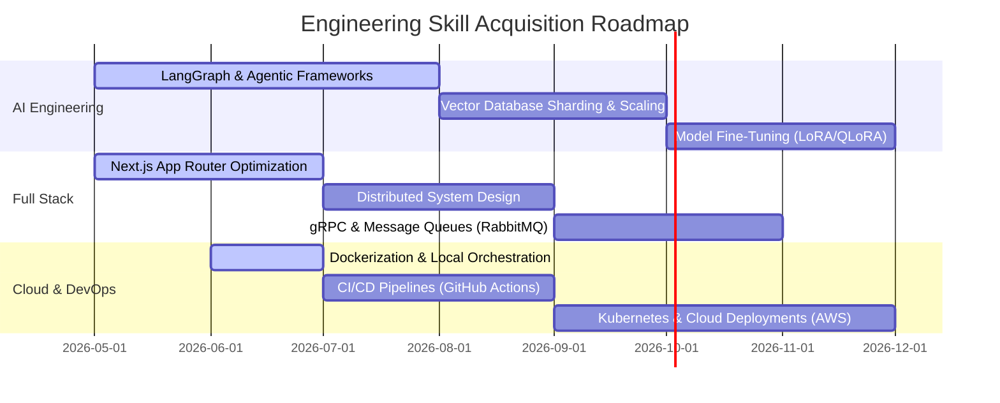

# 🌌 Kartik Shukla
### **AI Engineer & Full Stack Developer**
#### *Building Intelligent Systems & High-Performance Web Architectures*

  

  
  
  
  

---
### 🚀 About Me
I am a forward-thinking **AI Engineer** and **Full Stack Developer** focused on creating robust, scalable, and intelligent applications. As a Computer Science Engineering student, I combine academic rigor with practical development experience. My primary focus lies at the intersection of **Generative AI (LLMs, Vector Databases, and Multi-Agent Workflows)** and **Modern Web Architectures (FastAPI, Next.js, and Distributed Databases)**.
* 💡 **Core Mission:** Bridging the gap between cognitive AI intelligence and highly responsive, user-centric web applications.
* 📍 **Location:** Lucknow, India (Open to global remote opportunities & relocation).
* 👔 **Goal:** Securing high-impact internships and collaborating on cutting-edge AI or full-stack initiatives.
---
### 🛠️ Tech Stack & Tooling
<table>
  <tr>
    <td valign="top" width="50%">
      <h4>🤖 Artificial Intelligence & GenAI</h4>
      
      
      
      
      
      
    </td>
    <td valign="top" width="50%">
      <h4>💻 Frontend Engineering</h4>
      
      
      
      
      
    </td>
  </tr>
  <tr>
    <td valign="top" width="50%">
      <h4>⚙️ Backend & Databases</h4>
      
      
      
      
      
    </td>
    <td valign="top" width="50%">
      <h4>🛠️ Cloud & Infrastructure</h4>
      
      
      
      
      
    </td>
  </tr>
</table>
---
### 📂 Featured Projects
#### 1. 🎓 **AI Study Assistant**
*An intelligent, multi-agent academic platform that revolutionizes the way students consume, synthesize, and test themselves on complex materials.*
* **Core Functionality:** Processes textbooks, lecture notes, and PDFs to generate interactive semantic search indices, automated dynamic flashcards, and personalized retrieval-augmented learning paths.
* **Architecture:** Implements a RAG (Retrieval-Augmented Generation) pipeline using FastAPI, Next.js, LangChain, and PostgreSQL.
* **Highlight:** Utilizes hybrid vector-lexical search to achieve 95% accuracy in context-specific study recommendations.
* **Tech Stack:** `FastAPI` | `Next.js` | `LangChain` | `PostgreSQL` | `Pinecone` | `TypeScript`
#### 2. ⚡ **Ultra AI Chatbot**
*A premium, high-concurrency conversational interface designed for low-latency tool execution and advanced state management.*
* **Core Functionality:** Supports dynamic schema-based tool calling (web searching, math parsing, calendar booking) with asynchronous stream handling and multi-session persistence.
* **Architecture:** Scaled backend logic utilizing Python and FastAPI with Redis caching to support concurrent real-time web-socket streams.
* **Highlight:** Implemented custom sliding-window token memory to optimize LLM context usage and lower compute costs by 30%.
* **Tech Stack:** `Python` | `FastAPI` | `Next.js` | `Redis` | `OpenAI API` | `Tailwind CSS`
---
### 🎯 Current Focus & Horizon
* 🧠 **AI Agents:** Designing autonomous agent frameworks utilizing memory persistence structures (LangGraph, AutoGen).
* 🗄️ **Advanced Databases:** Master-replica replication, query optimization, and connection pooling in PostgreSQL.
* ⚡ **Performance Optimization:** Edge computing, server-side rendering patterns, and caching mechanics with Redis.
---
### 🗺️ Engineering Roadmap

---
### 🏛️ Developer Philosophy
> *"Code is not just instructions for a CPU; it is the blueprint of user experience and system reliability. I write code that is clean, self-documenting, and designed for change, keeping developer velocity and runtime performance in perpetual equilibrium."*
---
### 📊 GitHub Diagnostics & Statistics
<table align="center">
  <tr>
    <td align="center" width="50%">
      
    </td>
    <td align="center" width="50%">
      
    </td>
  </tr>
  <tr>
    <td align="center" colspan="2">
      
    </td>
  </tr>
</table>

  

---
### 🤝 Open Source & Community Engagement
* **Active Contributor:** Enthusiastic about contributing to GenAI SDKs, FastAPI ecosystems, and Next.js libraries.
* **Technical Writing:** Occasional writer on Medium/Dev.to sharing deep dives into RAG implementation details and Next.js rendering cycles.
* **Collaborations:** Always looking to team up with engineers, researchers, and designers. If you have an exciting idea or code base, let's connect!
---

  <i>"Simplicity is the ultimate sophistication."</i> — Leonardo da Vinci

